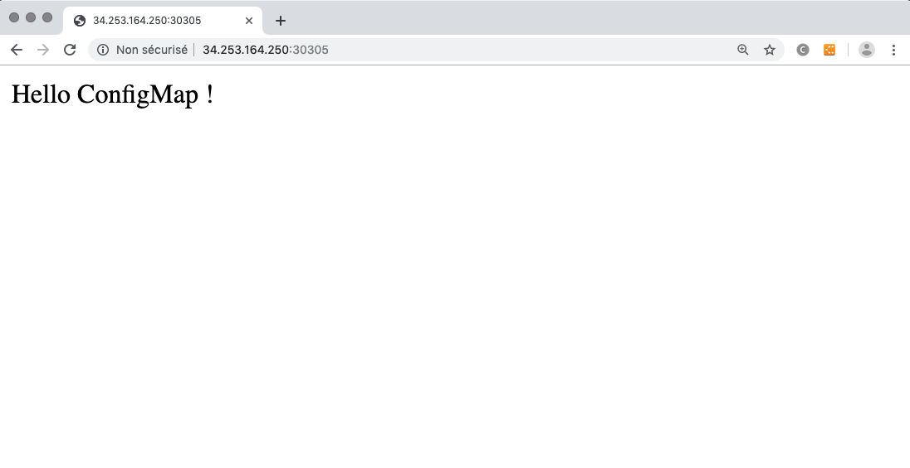

In this example, we just deploy an apache and expose it via a NodePort services.
The apache has an config map configuration referring to a variable `content` defined in the Apache component.

It is displayed in the index.html file by using postStart exec command in the container.

## What is tested

* Container into a Deployment
* NodePort Service that expose a container's endpoint
* Usage of ConfiMap configure a container
* Fill a configMap file with a node property.
* postStart exec command of a container

## How to deploy

Deploy the topology, the NodePort service port will appear in the Deployment Info page, test the application using the IP address of one of the nodes of the K8S cluster.

You can alternatively change the value of the property 'content' of the container in the topology and see the result after deployment.

## Expected result

When you test the url http://nodeIp:nodePort you should see :

