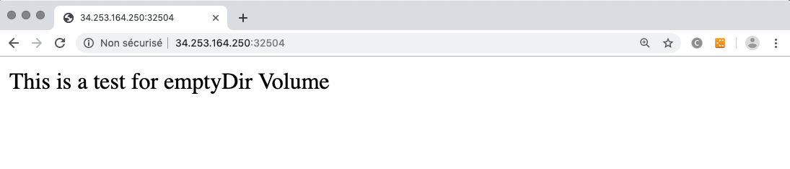

In this example :
* we deploy a sidecar busybox which will add a message in an index.html file in a emptyDir volume
* on same deployment we add a apache that will expose the content of the same emptyDir as it's /usr/local/apache2/htdocs

As a result, the message writed by the sidecar is viewable in the website.

## What is tested

* Container into a Deployment
* NodePort Service that expose a container's endpoint
* emptyDir volume shared by 2 containers
* postStart exec command of a container

## How to deploy

Deploy the topology, the NodePort service port will appear in the Deployment Info page, test the application using the IP address of one of the nodes of the K8S cluster.

You can alternatively change the value of the property 'content' of the container in the topology and see the result after deployment.

## Expected result

When you test the url http://nodeIp:nodePort you should see :

