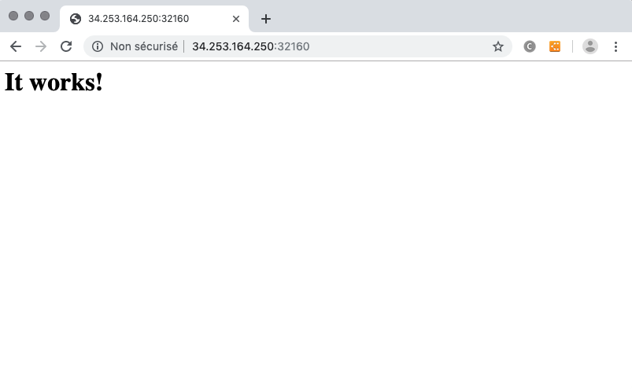

This topology  deploys 2 apache containers. Client one is displaying property data from server one

In this example, we  deploy :
* an apache and expose it via a clusterIP service
* an apache and expose it via a nodePort service

## What is tested

* Container into a Deployment
* NodePort Services that expose a container's endpoint
* Interconnect of 2 containers with a clusterIP  service and displaying its Apache Homepage by the nodePort service
* Dependancies of 2 containers : the pod that hosts the ApacheClient container  will be running after the pod that hosts the ApacheServer container is running
* postStart exec command of a container

## How to deploy

Deploy the topology, 

* A NodePort service ports will appear in the Deployment Info page, 
* Test the application using the IP address of one of the nodes of the K8S cluster with the  service

## Expected result

When you test the url http://nodeIp:nodePort/index2.html (DefaultPort) you should see after 2 minutes:

