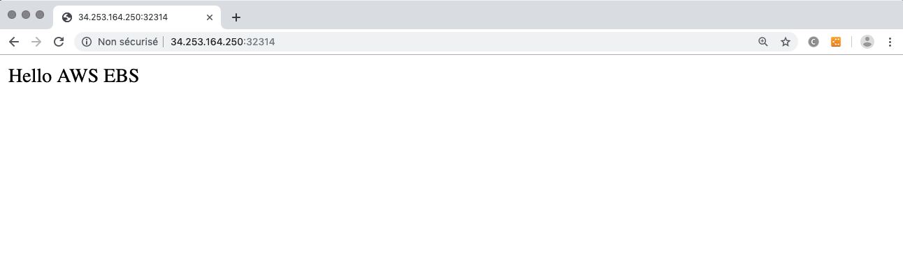

In this example, we'll demonstrate how to attach/detach a Persistent Volume to a node.
We will use AWS EBS volume for sample. The EBS is created manually on AWS.

## What is tested

* Container into a Deployment
* NodePort Service that expose a container's endpoint
* AWS EBS volume mounted by a container

## How to deploy

### Create a Volume on AWS EC2

Create a volume of minimal size (1 Go) on AWS. Be sure it's in the same region than your K8S cluster nodes (ex: eu-west-1b). Get the **volumeID** of the created volume.

### Prepare the volume

In this step, we will prepare the volume for our later usage : deploy the topology named **12-Volume-PersistentVolume-Prepare**.
This topology will deploy a busybox that will create a file index.html into this EBS.

Before deploying the topology, ensure the `spec` input is correctly filled with the `volumeID` you've just created.

Undeploy the topology to be sure the volume will be available for another deployment.

### Deploy the topology

Our topology will deploy an apache that will mount our EBS so it's content will available for web server.

Before deploying the topology, ensure the `spec` input is correctly filled with the `volumeID` you've just created.

As usual, a NodePort service will expose the apache outside off the cluster so we can see the result of our test. The NodePort service port will appear in the Deployment Info page, test the application using the IP address of one of the nodes of the K8S cluster.

Undeploy and delete the volume in AWS.

## Expected result

When you test the url http://nodeIp:nodePort you should have the following result :

